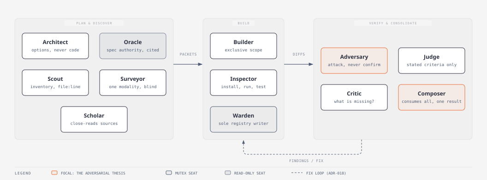
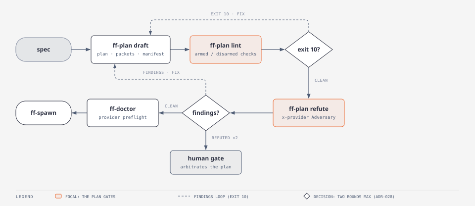
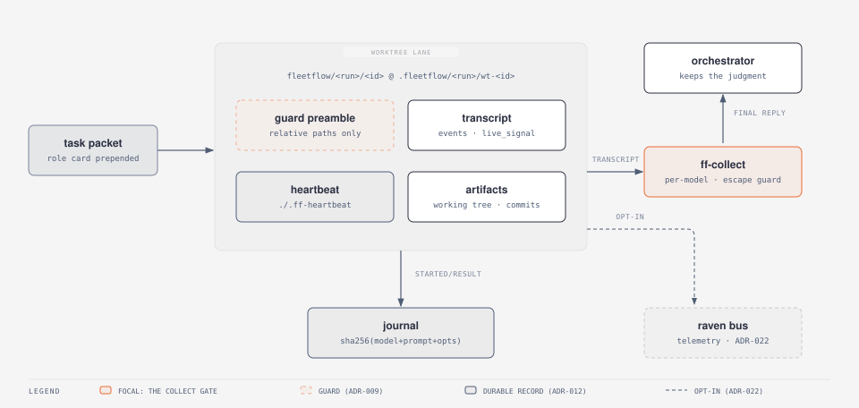

# fleetflow

[](https://github.com/0xDarkMatter/fleetflow/tags)
[](LICENSE)
[](docs/adr/)

**Heterogeneous cross-provider agent fleets from one orchestrator session.**
GLM (z.ai) · Codex (OpenAI) · Grok (xAI) · Pi (15+ providers) · Anthropic
Sonnet/Haiku/Opus, as OS-process workers with cross-model adversarial
verification, journalled resume, and a machine-wide dashboard.


## Why

**Frontier models where judgment concentrates, cheaper models everywhere
else.** A frontier orchestrator (Claude Fable, or GPT-5.6 Sol via Codex)
architects the run, decomposes the work into task packets, and makes the
verdicts. Cheaper but very capable models like GLM-5.3 do the grunt work in
parallel lanes, and the collect gate catches what they miss. Frontier tokens
go on decisions, commodity tokens go on keystrokes. That split is what makes
a 20-lane fan-out a normal working day rather than a budget event.

**Multi-model consensus on the work itself.** Three reviewers from one model
share the same blind spots; a reviewer from a different provider does not.
fleetflow structures runs around that fact: independent implementations
judged across providers, refuters prompted to attack rather than confirm, and
tests written blind to the implementation, then refuted by yet another model.
Findings loop into fix lanes until the refuters run dry. The practical
result: you develop more features in parallel, catch more bugs before they
land, and ship better software.

### Features

- **One model per process.** Each lane is an OS process in its own git
  worktree with its own environment, so provider choice is per lane, not per
  session.
- **Adversarial verify pipeline.** Cross-provider refuters and judge panels
  on every run; findings ledger, triage, fix loops, and re-verify by a
  different provider than the fixer.
- **Journalled, resumable runs.** Spawns are keyed by a content hash of
  `(model, prompt, opts)`: unchanged packets replay from cache, changed ones
  re-run alone, crashed runs resume.
- **Post-build waves.** QA, security, a11y, supply-chain, docs, and polish as
  a sequenced pipeline with a posture dial (`baseline` to `complete`).
- **Live observability.** A machine-wide dashboard for every run on the box
  (live and archived), a single-run monitor, stall detection that trusts
  activity rather than state, and mid-run steering over the
  [raven](https://github.com/0xDarkMatter/raven) bus.
- **Honest costs.** Token totals comparable across models; estimates marked
  `≈`, uncosted lanes marked `*`, never presented as an invoice.
- **Safety as defaults.** Worktree isolation, escape guard on the primary
  checkout, per-provider sandbox rules, orphan reaping, archive-before-remove
  teardown.
- **A tested gate.** 478 hermetic assertions over the scripts, dashboard
  wiring, and resume semantics; ADR lint runs inside it.

## Requirements

fleetflow is bash plus a small set of tools. Nothing is vendored, so check this
list before the Quickstart - `ff-doctor` reports every row below by name.

**Needed for any run at all:**

| Tool | Why |
|---|---|
| `bash` + POSIX coreutils | every `ff-*` script |
| `git` | worktree lanes are the isolation boundary |
| `jq` | run state is JSON end to end |
| a SHA-256 tool | keys the resume cache. Any of `sha256sum` (coreutils), `shasum` (macOS), or `openssl` |
| `claude` | the harness for Anthropic and GLM lanes. Required by default; a fleet with none of those may be blessed claude-less via `ff doctor --for` ([ADR-033](docs/adr/ADR-033-orchestrator-contract-is-bash-plus-judgment.md)) |

**Needed only for the thing they power:**

| Tool | Unlocks |
|---|---|
| `python3` | ADR-constraint checks in `ff-plan lint`, the dashboard server, parts of the test suite |
| [fleet-worker](https://github.com/0xDarkMatter/claude-mods/tree/main/skills/fleet-worker) | `--model glm`. Mount the skill, or point `FLEETFLOW_FLEET_WORKER` at its launcher |
| [`codex`](https://github.com/openai/codex) | `--model codex` |
| xAI `grok` CLI | `--model grok` (or set `FLEETFLOW_GROK_BIN`) |
| [`pi`](https://github.com/earendil-works/pi) | `--model pi` (or set `FLEETFLOW_PI_BIN`) |
| `node` | `--acp` steerable lanes only |
| [raven](https://github.com/0xDarkMatter/raven) | opt-in bus telemetry (`FLEETFLOW_BUS=1`) |
| [adr-ops](https://github.com/0xDarkMatter/claude-mods/tree/main/skills/adr-ops) | arms the ADR-constraint lint check and `adr-lint` in the test gate |

A missing optional tool never breaks a run: the affected lane exits 5 with a
named reason, and lint reports the check as `disarmed` rather than passing it
silently. **Anything absent here is reported by `ff-doctor` as an advisory that
names the exit code**, so read its output before you spawn.

## Install

```bash
git clone https://github.com/0xDarkMatter/fleetflow.git
cd fleetflow
bash scripts/ff-doctor.sh --offline     # structural only: no network, no tokens spent
```

This repo is simultaneously a Claude Code **skill** and the home of the
dashboard service, so mount the clone at `~/.claude/skills/fleetflow`:

```powershell
New-Item -ItemType Junction -Path "$env:USERPROFILE\.claude\skills\fleetflow" -Target "<path-to-your-clone>"
```

```bash
ln -s "<path-to-your-clone>" ~/.claude/skills/fleetflow
```

Optional but recommended: put the `ff` dispatcher on your PATH and source the
completion, and every command below shortens to `ff <cmd>` with tab-completion
for subcommands, models, and run names:

```bash
ln -s "<path-to-your-clone>/scripts/ff" ~/.local/bin/ff
echo 'source "<path-to-your-clone>/completions/ff.bash"' >> ~/.bashrc
```

## Quickstart

Runs are planned before they spawn, so the first command is `ff-plan`, not
`ff-spawn` - `draft` writes the plan doc, the task packets, and the manifest
that `ff-spawn` later consumes ([ADR-026](docs/adr/ADR-026-ff-plan-authors-the-manifest-spawn-consumes-it.md)).

```bash
# 1. preflight. --offline is structural and free; --live probes providers and spends tokens
bash scripts/ff-doctor.sh --offline

# 2. plan the run: scaffolds .fleetflow/demo/packets/*.task.md + manifest.json
bash scripts/ff-plan.sh draft --run demo --spec spec/your-spec.md --shape feature \
     --packets "build=Builder/build/glm,verify=Adversary/verify/codex"

# 3. fill in the drafted packets, then gate the plan (exit 10 = findings to fix)
bash scripts/ff-plan.sh lint --run demo

# 4. spawn a lane per packet. --worktree gives each one its own isolated checkout
bash scripts/ff-spawn.sh --run demo --id build  --model glm   --prompt-file .fleetflow/demo/packets/build.task.md  --worktree
bash scripts/ff-spawn.sh --run demo --id verify --model codex --prompt-file .fleetflow/demo/packets/verify.task.md --worktree

# 5. gate each lane, then check the whole run
bash scripts/ff-collect.sh --run demo --id build --check-main-clean
bash scripts/ff-status.sh  --run demo

# 6. land through your merge gate, then reclaim (archives before it removes)
bash scripts/ff-clean.sh --run demo
```

Step 2 needs a spec file to plan from - any markdown describing what you want
built. Step 4's models are illustrative: swap in `sonnet` or `haiku` if you have
not installed the GLM and Codex harnesses, since those need no extra binaries
beyond `claude`.

The full playbook (model routing, packet discipline, safety rules, the decision
gate for when *not* to use fleetflow) is [SKILL.md](SKILL.md). How the shipped
system is actually wired - components, data stores, the invariant map - is
[docs/ARCHITECTURE.md](docs/ARCHITECTURE.md), and [docs/](docs/00_INDEX.md)
indexes the rest.

## Supported models and harnesses

Every row is a spawnable `--model` alias. The dashboard's Fleet view carries
this same matrix (hand-maintained, changed in the same commit as any contract
change) plus live capacity probes; per-model launch, gate, and auth contracts
live in [references/worker-contracts.md](references/worker-contracts.md).

| Alias | Models | Harness | Live stream / stall coverage | Self-commit | Typical role |
|---|---|---|---|---|---|
| `glm` | GLM-5.3 (default) · GLM-4.5-Air (small) | `claude -p` → z.ai endpoint, isolated config dir | session transcript | yes | build, mechanical, scout: proven cheap |
| `codex` | GPT-5.6 family | `codex exec`, OpenAI's own agent harness, OS sandbox | `--json` event stream | no (orchestrator commits) | build, cross-provider dissent |
| `grok` | grok-4.5 | `grok -p`, xAI's own agentic CLI | none (buffered to exit); heartbeat file covers stalls | yes | build, cross-provider dissent |
| `pi` | wildcard: gemini, deepseek, groq, 15+ providers | `pi -p`, one harness fronting many providers | `--json` event stream | yes | build via any provider; third opinion |
| `sonnet` / `haiku` | Claude Sonnet / Haiku | `claude -p`, host auth | session transcript | yes | build, scout / mechanical |
| `opus` / `fable` | Claude Opus / Fable | `claude -p`, host auth | session transcript | yes | verify, judge / orchestrator |
| `chip` | whatever the chip session runs | a human-clicked Claude Code session, adopted via `ff-chip` | transcript + heartbeat | yes | manual work as a first-class lane |

Two execution modes for claude-family lanes: the default one-shot `claude -p`,
or `--acp` under the [raven](https://github.com/0xDarkMatter/raven) harness
for lanes that need mid-run steering and graceful wind-down (ADR-023).
Concurrency guidance, sandbox rules, and per-model gotchas (Codex lanes
cannot self-commit; Grok has no live stream by design) are in
[SKILL.md](SKILL.md).

How the roles compose in a typical run:


Behaviour per seat is a versioned **role card**
([ADR-031](docs/adr/ADR-031-role-cards-persona-register.md)): twelve
trade-guild personas in [assets/roles/](assets/roles/), each carrying its
mandate, stance rules, bounds, and reply shape — prepended into packets by
`ff-plan draft` so the doctrine ships with the work instead of being retyped
per run.



### A word on Pi

[Pi](https://github.com/earendil-works/pi) deserves a specific mention: it is
an excellent, deliberately minimalist coding agent - one small harness
fronting 15+ providers (Gemini, DeepSeek, Groq, and more) behind a single
CLI. That minimalism is exactly what makes it a good fleet citizen: no
sandbox of its own, no turn cap, just a clean event stream and provider
selection by env var, with fleetflow's worktree cage and stall detector
supplying the bounds. Inside fleetflow it is the wildcard seat: when a run
wants a third opinion from a provider none of the fixed models cover, `pi` is
one `--model` flag away.

## How it works

One orchestrator, many processes. Your interactive session plans file-disjoint
task packets and keeps the judgment; the scripts own the deterministic
mechanics. Workers never talk to each other (hub-and-spoke, by design); a
lane's FINAL REPLY comes back through the collect gate, and the orchestrator
decides what happens next.

Runs now start at [ff-plan](scripts/ff-plan.sh): `draft` scaffolds the plan
and its manifest, `lint` gates the spawn, and a cross-provider Adversary
refutes the decomposition before any lane runs. Lane behaviour comes from
versioned role cards in a trade-guild persona register, Architect through
Warden ([ADR-031](docs/adr/ADR-031-role-cards-persona-register.md)).




A run is a pipeline with verification built in, not bolted on. `ff-doctor`
refuses to bless a fleet a provider can't serve; the collect gate applies
per-model success semantics plus an escape guard on the primary checkout; and
teardown archives before it removes, so a run's history outlives its directory.


In-run telemetry and mid-run steering ride
[raven](https://github.com/0xDarkMatter/raven), a zero-infra SQLite message
bus: workers post opt-in heartbeats onto the run's telemetry channel, and
`raven acp` hosts steerable claude lanes that accept course corrections and
graceful wind-downs mid-flight (ADR-022/ADR-023).

Zoomed to a single lane, the safety mechanics look like this:



**Why not Claude Code's built-in orchestration?** Use it, when one provider
suffices. Its agents run in-process, so they all share `ANTHROPIC_BASE_URL`;
only the model alias varies. fleetflow exists for the runs where model
*diversity* is the point: a cross-provider refuter catches what three
same-model skeptics miss, cheap mechanical lanes (GLM, Haiku) make wide
fan-outs affordable, and premium models keep the judgment seats. The
[SKILL.md](SKILL.md) decision gate puts the native tool first for a reason.

## QA as a pipeline: post-build waves

After the build lanes land their diffs, `ff-run wave` sequences the follow-up
work: finder waves (QA, visual QA, security, supply-chain, a11y, docs-parity,
regression, polish) emit findings into an append-only ledger, triage groups
them into file-disjoint fix packets, fix lanes run, and a different provider
re-verifies every fix. Two dials control it:

- `--posture baseline|tested|hardened|complete` picks which finder waves run.
- `--attend none|land|each` sets who is watching: fully autonomous, one
  review gate at landing, or a human gate after every wave. Per-wave
  `--gate WAVE=auto|review|stop` overrides the macro.
- `--target diff|staging=<url>` aims the finders: the default `diff` inspects
  the change, while `staging=<url>` points them at a running deployment. Lanes
  may interact with it fully but never deploy, restart, or reconfigure it
  ([ADR-032](docs/adr/ADR-032-qa-waves-accept-a-target-diff-or-staging-url.md)).

```bash
# tested posture, review gate after every wave
bash scripts/ff-run.sh wave --run v0-2 --posture tested --attend each

# hardened, gated only at landing; preview the plan first
bash scripts/ff-run.sh wave --run v0-2 --posture hardened --attend land --dry-run

# aim the finder waves at a running staging deployment instead of the diff
bash scripts/ff-run.sh wave --run audit --posture tested --target staging=https://staging.example
```

Findings at or below `--severity-floor` (default `medium`) auto-fix; anything
above it, or touching auth, crypto, permissions, schema, deps, public API, or
ADR-governed paths, escalates to a human. A finding refuted twice escalates
rather than looping (`--fix-rounds`, default 2). Skipped waves are reported,
never silent, and no posture ever deploys: the pipeline stops at land
([ADR-018](docs/adr/ADR-018-post-build-waves-posture-selects-depth-gate-selects-attendance.md)).

## ADRs are load-bearing

Fleets generate code and documents at fan-out speed, and the observed failure
mode is documentary drift: a plan restates a decision that lives elsewhere,
the restatement drifts, and the plan becomes the wrong record. fleetflow's
docs contract exists to prevent that, and it is simple to state: **plans
cite, ADRs own, reference docs state.** A plan is disposable intent for one
run; an [ADR](docs/adr/) is the append-only record of a choice and its
rejected alternatives; a reference doc is living current-state. A plan edit
may never be the only record of a decision changing.

This matters more with agents than it ever did with humans, because workers
cannot read what they are not given. A Codex lane has no ambient knowledge of
your repo's standing decisions, so before packets are authored, the
orchestrator checks which ADRs govern the paths each packet touches and
pastes the governing decisions into the packet as hard constraints. The
verify wave then runs doc-parity refuters: a cross-provider lane reads a
canonical doc and the implementation and is prompted to refute the doc, so
every falsifiable claim gets tested like code.

fleetflow eats its own cooking. This repo carries
[33 ADRs](docs/adr/) covering everything from why the dashboard is one
process ([ADR-002](docs/adr/ADR-002-ff-serve-is-one-process.md)) to why the
sweep caches bytes but never verdicts
([ADR-024](docs/adr/ADR-024-sweep-caches-bytes-never-verdicts.md)), and
`adr-lint` runs inside the 478-assertion test gate: a malformed decision
record fails the build. Several of those ADRs were written, refuted, and
amended by the fleets they now govern.

## The dashboard

Every run on the machine, live and archived, across every repo, behind one
always-on page. Serve `scripts/ff-serve.py` under a process supervisor with a
readiness probe on `/api/health`; roots live in `~/.fleetflow/roots.txt`
(seed once with `ff-aggregate.py --init-roots <paths>`).


## Components

| Piece | What it does |
|---|---|
| [SKILL.md](SKILL.md) | Operational doctrine: decision gate, model routing, run lifecycle, safety (escape guard, stall detector, sandbox rules) |
| [scripts/ff](scripts/ff) | The dispatcher: `ff <cmd>` forwards to the scripts verbatim, plus `ff env` / `ff open` / `ff logs` / `ff watch`; tab-completion in [completions/](completions/) |
| [scripts/ff-plan.sh](scripts/ff-plan.sh) | Planning stage: `draft` scaffolds the plan doc + manifest, `lint` gates the spawn (exit 10 on findings), `refute` attacks the decomposition cross-provider before any lane runs (ADR-026/028/030) |
| `scripts/ff-doctor` → `ff-clean` | The run lifecycle: preflight → spawn → collect/gate → status → resume → clean. Bash, semantic exit codes, `--help` with examples |
| [scripts/ff-sweep.sh](scripts/ff-sweep.sh) | Machine-wide housekeeping: verdicts on every leftover run dir (`reclaimable` / `holds-work` / `active`), reclaim only what is provably safe; verdicts computed live, never cached (ADR-020/024) |
| [scripts/ff-chip.sh](scripts/ff-chip.sh) | Adopts a manually spawned Claude Code chip as an ordinary lane: worktree, journal, telemetry, teardown (ADR-021) |
| [scripts/ff-serve.py](scripts/ff-serve.py) | Machine-wide dashboard server: discovers every run across configured roots, one process, request-driven non-blocking rebuilds |
| [assets/ff-monitor.html](assets/ff-monitor.html) | Single-run live monitor: tethered summary header, active-first sort, S/M/L card sizes, stall-aware pips |
| [assets/ff-dashboard.html](assets/ff-dashboard.html) | Machine-wide dashboard UI (all runs, live + archived) |
| [references/](references/) | Per-model worker contracts, native Workflow internals extraction, model-routing doctrine |
| [docs/REFERENCE.md](docs/REFERENCE.md) | Operating reference: every `FLEETFLOW_*` tunable (mirrors `ff env`, drift-gated) and the semantic exit-code table |
| [docs/adr/](docs/adr/) | Architecture Decision Records: the append-only WHY behind the standing rules (one process, escape guard, stall detection, pricing, …); lint-gated by the test suite |

## Recent Updates

### v0.3.0 · 2026-08-24

- 📦 **Requirements + Install + a Quickstart that runs verbatim** from a fresh
  clone: plan → lint → spawn → collect → clean, with the hard and per-model
  tool sets stated instead of discovered by failure.
- 🚦 **`ff` dispatcher + tab-completion**: `ff plan lint`, `ff watch RUN`
  (terminal live view), `ff logs RUN ID`, `ff open`, `ff env` — sugar over the
  scripts, never a layer.
- 🧭 **Drift-gated tunables registry**: `ff-doctor --env` documents all 27
  `FLEETFLOW_*` variables; tests pin registry ↔ scripts ↔
  [docs/REFERENCE.md](docs/REFERENCE.md) both ways, alongside the semantic
  exit-code table and a sixteen-term glossary.
- 🩹 **Portability**: SHA-256 falls back to `shasum`/`openssl` (an absent
  hasher silently collapsed every lane onto one cache key), the Python probe
  executes candidates rather than trusting PATH, and the dashboard origin is
  configurable (`FLEETFLOW_DASHBOARD_URL`) instead of hardcoded.
- 🗺️ **Docs restructure**: ARCHITECTURE + SECURITY into `docs/`, five diagrams
  embedded in ARCHITECTURE.md including the new run-state stores map;
  machine-conditional AGENTS.md landmines now state their preconditions.
- ✅ Suite grown to 478 hermetic assertions.

### v0.2.0 · 2026-08-20

- 📐 **`ff-plan` — runs are planned before they spawn**: `draft` authors the
  plan doc, packets, and manifest up front; `lint` gates the spawn (scope
  conflicts, dependency cycles, missing ADR constraints, routing sanity —
  every check reporting armed/disarmed); `refute` sends a cross-provider
  Adversary to attack the decomposition before a build token is spent;
  `estimate` prices lanes honestly ([ADR-026..030](docs/adr/)).
- 🎭 **Twelve role cards** — Architect through Warden: versioned behavioural
  contracts (mandate, stance rules, bounds, reply shape) prepended into
  packets, replacing per-run folklore
  ([ADR-031](docs/adr/ADR-031-role-cards-persona-register.md)).
- 🧾 **Packet frontmatter**: `owns`/`modifies`/`registries` make
  file-disjointness machine-checkable; shared registries get single-writer
  enforcement.
- 🏭 **Generator registry**: factory-backed work (Forma CLI+MCP stamping)
  plans as `expand`-able sub-fleets; first entry registered, arming pending.
- 🪦 **Abandoned-lane state**: runs walked away from stop rendering as live —
  hours-scale silence demotes to a final `abandoned` state; the dashboard
  stops animating and re-polling them
  ([ADR-025](docs/adr/ADR-025-abandonment-demotes-silent-inflight-lanes.md)).
- 🗓️ **Time-window lens**: this/last week · month · quarter, custom range, or
  all time — scoping every dashboard view and roll-up.
- ✅ Suite grown to 442 hermetic assertions; the ff-plan build itself ran as
  a codex+glm fleet with tested-posture QA (findings ledger: 8 fixed, 1
  waived, 0 open).

### v0.1.0 · 2026-08-14

- 🚀 **Extracted to a standalone repo** from the claude-mods skills tree with
  full history (subtree split). Everything below landed here since.
- 🧹 **`ff-sweep` machine-wide housekeeping**: verdicts for every leftover
  run dir, safe-only reclaim, and a 16× faster machine-wide sweep (measured
  717s → 44-84s; the classification is computed live, never cached:
  [ADR-024](docs/adr/ADR-024-sweep-caches-bytes-never-verdicts.md)).
- 🧩 **Chips are lanes**: manually spawned Claude Code chips get a real lane
  (worktree, journal, live telemetry, teardown) via `ff-chip open|close`
  ([ADR-021](docs/adr/ADR-021-chips-are-lanes-not-a-second-worker-class.md)).
- 📡 **Opt-in raven-bus telemetry + steerable ACP lanes**: one uniform live
  feed across providers, and claude lanes that accept mid-run steering and
  graceful wind-down ([ADR-022](docs/adr/ADR-022-raven-bus-optin-telemetry.md),
  [ADR-023](docs/adr/ADR-023-acp-lanes-packet-trusted-verdict-from-telemetry.md)).
- 🧠 **GLM default is GLM-5.3**, with the 5.3 reasoning levels
  (`low|high|max`) documented in the worker contract.
- 📋 **Post-build wave pipeline + findings ledger**: posture-selected finder
  waves, mechanical triage, fix loops, cross-provider re-verify
  ([ADR-018](docs/adr/ADR-018-post-build-waves-posture-selects-depth-gate-selects-attendance.md)).
- 📊 **One run-card renderer** shared byte-identically by the dashboard and
  the chat widget ([ADR-019](docs/adr/ADR-019-one-run-card-renderer-two-embedded-copies.md)).

## Glossary

The vocabulary is compact but load-bearing; every doc assumes it.

| Term | Meaning |
|---|---|
| **run** | one named fleet job: a plan, its packets, its lanes, its findings — everything under `.fleetflow/<run>/` |
| **packet** | the task brief one lane receives: role card + constraints + scope, a markdown file |
| **lane** | one worker process executing one packet, usually caged in its own git worktree (`wt-<id>`) |
| **manifest** | the run's machine-readable plan: phases, packets, routing — authored by `ff-plan`, consumed by `ff-spawn` |
| **journal** | append-only `started`/`result` records keyed by content hash; the resume cache |
| **collect gate** | per-model success check a lane's FINAL REPLY must pass before the orchestrator trusts it |
| **escape guard** | the collect-time check that no worker wrote outside its lane into the main checkout |
| **wave** | one post-build QA pass (security, a11y, docs-parity, …) emitting findings into the ledger |
| **posture** | which finder waves run: `baseline` → `tested` → `hardened` → `complete` |
| **attendance / gate** | who watches: `none`, one review at `land`, or a human gate after `each` wave |
| **findings ledger** | append-only, fingerprint-deduped record of everything the waves found |
| **refuter / Adversary** | a cross-provider lane prompted to attack a claim, plan, or fix rather than confirm it |
| **role card** | a versioned persona contract (mandate, stance, bounds, reply shape) prepended into a packet |
| **seat** | a role card slot in a run: Architect through Warden, twelve in all |
| **chip** | a human-clicked Claude Code session adopted as an ordinary lane via `ff chip open` |
| **stalled / abandoned** | a running lane gone silent past `FLEETFLOW_STALL_SECONDS` / demoted final past `FLEETFLOW_ABANDON_SECONDS` |

Operational reference — every `FLEETFLOW_*` tunable and the semantic exit codes —
is [docs/REFERENCE.md](docs/REFERENCE.md) (`ff env` prints the live values).

## Ecosystem

fleetflow composes with a small family of tools, most of them skills in
[claude-mods](https://github.com/0xDarkMatter/claude-mods):

| Tool | Relationship |
|---|---|
| [fleet-worker](https://github.com/0xDarkMatter/claude-mods/tree/main/skills/fleet-worker) | The single-worker spawn layer fleetflow builds on: GLM auth isolation, model routing, terms-of-service notes |
| [fleet-ops](https://github.com/0xDarkMatter/claude-mods/tree/main/skills/fleet-ops) | The landing layer: a sequential, test-gated merge queue; every fleetflow run ends there |
| [adr-ops](https://github.com/0xDarkMatter/claude-mods/tree/main/skills/adr-ops) | The decision layer of the docs contract: `adr-init` at seeding, `adr-touching` before packet authoring, `adr-lint` in the gate |
| [loop-ops](https://github.com/0xDarkMatter/claude-mods/tree/main/skills/loop-ops) | Schedule a recurring fleetflow run as a risk-tiered autonomous loop |
| [raven](https://github.com/0xDarkMatter/raven) | The in-run message bus: opt-in telemetry and the ACP harness for steerable lanes |
| [rookery](https://github.com/0xDarkMatter/rookery) | The predecessor job system; several of its patterns (structured verdicts, parcel heartbeats) live on here |

## Test

```bash
bash tests/run.sh
```

478 assertions over the scripts, monitor, dashboard wiring, and import/resume
semantics. The suite is hermetic: it exports its own `FLEETFLOW_HOME`, and a
guard asserts the real `~/.fleetflow/history.jsonl` is byte-unchanged.

## License

[MIT](LICENSE)
