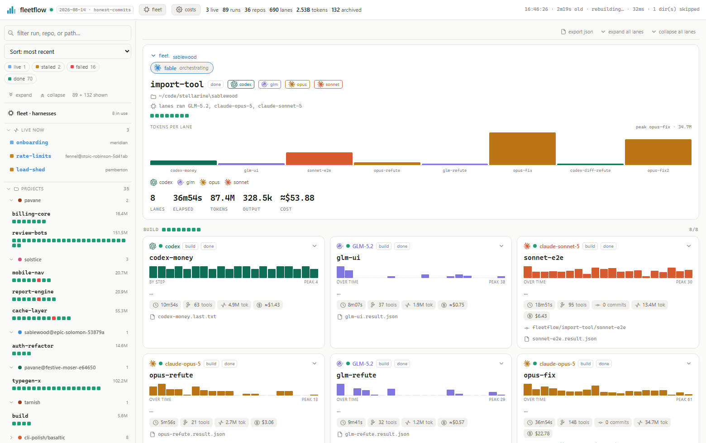
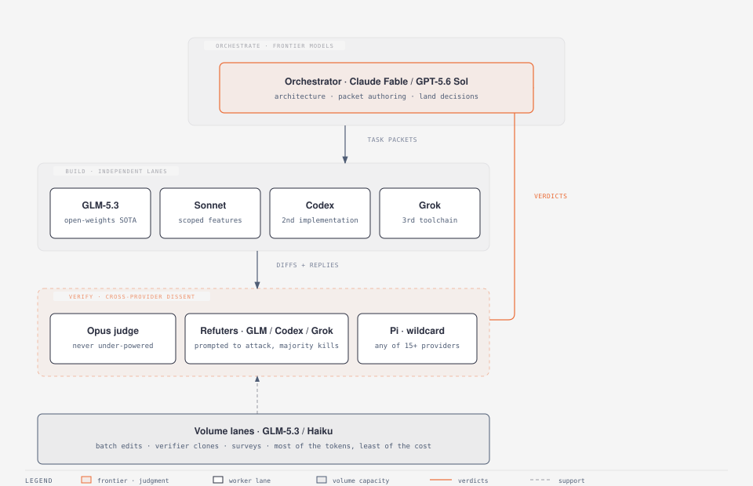
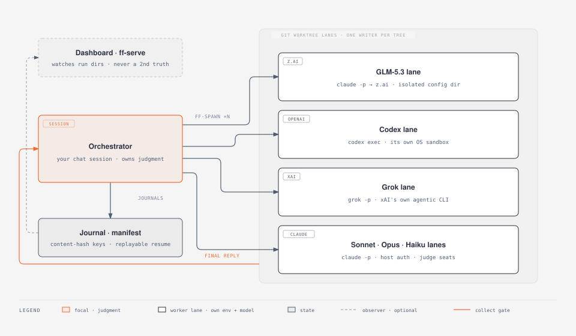
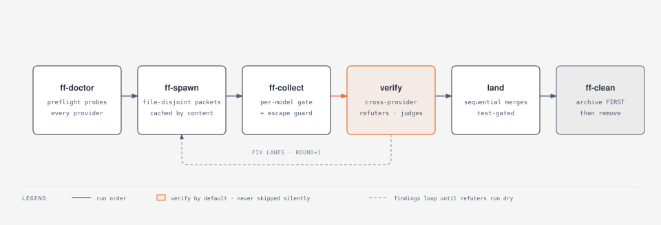
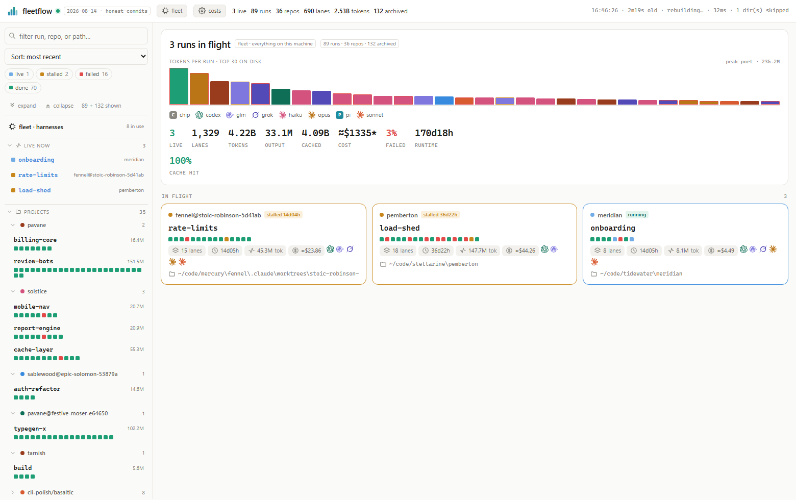

# fleetflow

**Heterogeneous cross-provider agent fleets from one Claude Code session.**
GLM (z.ai) · Codex (OpenAI) · Grok (xAI) · Pi (15+ providers) · Anthropic
Sonnet/Haiku/Opus, as OS-process workers with cross-model adversarial
verification, journalled resume, and a machine-wide dashboard.



## Why

**Frontier models where judgment concentrates, cheaper models everywhere
else.** A frontier orchestrator (Claude Fable, or GPT-5.6 Sol via Codex)
architects the run, decomposes the work into task packets, and makes the
verdicts. Cheaper but very capable models like GLM-5.3 do the grunt work in
parallel lanes, and the collect gate catches what they miss. Frontier tokens
go on decisions, commodity tokens go on keystrokes. That split is what makes
a 20-lane fan-out a normal working day rather than a budget event.

**Multi-model consensus on the work itself.** Three reviewers from one model
share the same blind spots; a reviewer from a different provider does not.
fleetflow structures runs around that fact: independent implementations
judged across providers, refuters prompted to attack rather than confirm, and
tests written blind to the implementation, then refuted by yet another model.
Findings loop into fix lanes until the refuters run dry. The practical
result: you develop more features in parallel, catch more bugs before they
land, and ship better software.

### Features

- **One model per process.** Each lane is an OS process in its own git
  worktree with its own environment, so provider choice is per lane, not per
  session.
- **Adversarial verify pipeline.** Cross-provider refuters and judge panels
  on every run; findings ledger, triage, fix loops, and re-verify by a
  different provider than the fixer.
- **Journalled, resumable runs.** Spawns are keyed by a content hash of
  `(model, prompt, opts)`: unchanged packets replay from cache, changed ones
  re-run alone, crashed runs resume.
- **Post-build waves.** QA, security, a11y, supply-chain, docs, and polish as
  a sequenced pipeline with a posture dial (`baseline` to `complete`).
- **Live observability.** A machine-wide dashboard for every run on the box
  (live and archived), a single-run monitor, stall detection that trusts
  activity rather than state, and mid-run steering over the
  [raven](https://github.com/0xDarkMatter/raven) bus.
- **Honest costs.** Token totals comparable across models; estimates marked
  `≈`, uncosted lanes marked `*`, never presented as an invoice.
- **Safety as defaults.** Worktree isolation, escape guard on the primary
  checkout, per-provider sandbox rules, orphan reaping, archive-before-remove
  teardown.
- **A tested gate.** 389 hermetic assertions over the scripts, dashboard
  wiring, and resume semantics; ADR lint runs inside it.

## Quickstart

```bash
# 1. preflight: don't spawn a fleet a doctor won't bless
bash scripts/ff-doctor.sh --live

# 2. author a task packet, then spawn a lane per packet (repeat per model)
bash scripts/ff-spawn.sh --run demo --id build --model glm   --prompt-file packets/build.task.md --worktree
bash scripts/ff-spawn.sh --run demo --id refute --model codex --prompt-file packets/refute.task.md --worktree

# 3. gate each lane, then check the whole run
bash scripts/ff-collect.sh --run demo --id build
bash scripts/ff-status.sh  --run demo

# 4. land through your merge gate, then reclaim
bash scripts/ff-clean.sh --run demo
```

The full playbook (model routing, packet discipline, safety rules, the
decision gate for when *not* to use fleetflow) is [SKILL.md](SKILL.md). This
repo is simultaneously a Claude Code **skill** (mount it at
`~/.claude/skills/fleetflow`) and the home of the dashboard service.

```powershell
New-Item -ItemType Junction -Path "$env:USERPROFILE\.claude\skills\fleetflow" -Target "<path-to-your-clone>"
```

```bash
ln -s "<path-to-your-clone>" ~/.claude/skills/fleetflow
```

## Supported models and harnesses

Every row is a spawnable `--model` alias. The dashboard's Fleet view carries
this same matrix (hand-maintained, changed in the same commit as any contract
change) plus live capacity probes; per-model launch, gate, and auth contracts
live in [references/worker-contracts.md](references/worker-contracts.md).

| Alias | Models | Harness | Live stream / stall coverage | Self-commit | Typical role |
|---|---|---|---|---|---|
| `glm` | GLM-5.3 (default) · GLM-4.5-Air (small) | `claude -p` → z.ai endpoint, isolated config dir | session transcript | yes | build, mechanical, scout: proven cheap |
| `codex` | GPT-5.6 family | `codex exec`, OpenAI's own agent harness, OS sandbox | `--json` event stream | no (orchestrator commits) | build, cross-provider dissent |
| `grok` | grok-4.5 | `grok -p`, xAI's own agentic CLI | none (buffered to exit); heartbeat file covers stalls | yes | build, cross-provider dissent |
| `pi` | wildcard: gemini, deepseek, groq, 15+ providers | `pi -p`, one harness fronting many providers | `--json` event stream | yes | third opinion no fixed model covers |
| `sonnet` / `haiku` | Claude Sonnet / Haiku | `claude -p`, host auth | session transcript | yes | build, scout / mechanical |
| `opus` / `fable` | Claude Opus / Fable | `claude -p`, host auth | session transcript | yes | verify, judge / orchestrator |
| `chip` | whatever the chip session runs | a human-clicked Claude Code session, adopted via `ff-chip` | transcript + heartbeat | yes | manual work as a first-class lane |

Two execution modes for claude-family lanes: the default one-shot `claude -p`,
or `--acp` under the [raven](https://github.com/0xDarkMatter/raven) harness
for lanes that need mid-run steering and graceful wind-down (ADR-023).
Concurrency guidance, sandbox rules, and per-model gotchas (Codex lanes
cannot self-commit; Grok has no live stream by design) are in
[SKILL.md](SKILL.md).

How the roles compose in a typical run:

<picture>
  <source media="(prefers-color-scheme: dark)" srcset="docs/diagrams/roles-dark.svg">
  
</picture>

### A word on Pi

[Pi](https://github.com/earendil-works/pi) deserves a specific mention: it is
an excellent, deliberately minimalist coding agent - one small harness
fronting 15+ providers (Gemini, DeepSeek, Groq, and more) behind a single
CLI. That minimalism is exactly what makes it a good fleet citizen: no
sandbox of its own, no turn cap, just a clean event stream and provider
selection by env var, with fleetflow's worktree cage and stall detector
supplying the bounds. Inside fleetflow it is the wildcard seat: when a run
wants a third opinion from a provider none of the fixed models cover, `pi` is
one `--model` flag away.

## How it works

One orchestrator, many processes. Your interactive session plans file-disjoint
task packets and keeps the judgment; the scripts own the deterministic
mechanics. Workers never talk to each other (hub-and-spoke, by design); a
lane's FINAL REPLY comes back through the collect gate, and the orchestrator
decides what happens next.

<picture>
  <source media="(prefers-color-scheme: dark)" srcset="docs/diagrams/architecture-dark.svg">
  
</picture>

A run is a pipeline with verification built in, not bolted on. `ff-doctor`
refuses to bless a fleet a provider can't serve; the collect gate applies
per-model success semantics plus an escape guard on the primary checkout; and
teardown archives before it removes, so a run's history outlives its directory.

<picture>
  <source media="(prefers-color-scheme: dark)" srcset="docs/diagrams/lifecycle-dark.svg">
  
</picture>

In-run telemetry and mid-run steering ride
[raven](https://github.com/0xDarkMatter/raven), a zero-infra SQLite message
bus: workers post opt-in heartbeats onto the run's telemetry channel, and
`raven acp` hosts steerable claude lanes that accept course corrections and
graceful wind-downs mid-flight (ADR-022/ADR-023).

**Why not Claude Code's built-in orchestration?** Use it, when one provider
suffices. Its agents run in-process, so they all share `ANTHROPIC_BASE_URL`;
only the model alias varies. fleetflow exists for the runs where model
*diversity* is the point: a cross-provider refuter catches what three
same-model skeptics miss, cheap mechanical lanes (GLM, Haiku) make wide
fan-outs affordable, and premium models keep the judgment seats. The
[SKILL.md](SKILL.md) decision gate puts the native tool first for a reason.

## ADRs are load-bearing

Fleets generate code and documents at fan-out speed, and the observed failure
mode is documentary drift: a plan restates a decision that lives elsewhere,
the restatement drifts, and the plan becomes the wrong record. fleetflow's
docs contract exists to prevent that, and it is simple to state: **plans
cite, ADRs own, reference docs state.** A plan is disposable intent for one
run; an [ADR](docs/adr/) is the append-only record of a choice and its
rejected alternatives; a reference doc is living current-state. A plan edit
may never be the only record of a decision changing.

This matters more with agents than it ever did with humans, because workers
cannot read what they are not given. A Codex lane has no ambient knowledge of
your repo's standing decisions, so before packets are authored, the
orchestrator checks which ADRs govern the paths each packet touches and
pastes the governing decisions into the packet as hard constraints. The
verify wave then runs doc-parity refuters: a cross-provider lane reads a
canonical doc and the implementation and is prompted to refute the doc, so
every falsifiable claim gets tested like code.

fleetflow eats its own cooking. This repo carries
[24 ADRs](docs/adr/) covering everything from why the dashboard is one
process ([ADR-002](docs/adr/ADR-002-ff-serve-is-one-process.md)) to why the
sweep caches bytes but never verdicts
([ADR-024](docs/adr/ADR-024-sweep-caches-bytes-never-verdicts.md)), and
`adr-lint` runs inside the 389-assertion test gate: a malformed decision
record fails the build. Several of those ADRs were written, refuted, and
amended by the fleets they now govern.

## The dashboard

Every run on the machine, live and archived, across every repo, behind one
always-on page. Serve `scripts/ff-serve.py` under a process supervisor with a
readiness probe on `/api/health`; roots live in `~/.fleetflow/roots.txt`
(seed once with `ff-aggregate.py --init-roots <paths>`).



## Components

| Piece | What it does |
|---|---|
| [SKILL.md](SKILL.md) | Operational doctrine: decision gate, model routing, run lifecycle, safety (escape guard, stall detector, sandbox rules) |
| `scripts/ff-doctor` → `ff-clean` | The run lifecycle: preflight → spawn → collect/gate → status → resume → clean. Bash, semantic exit codes, `--help` with examples |
| [scripts/ff-sweep.sh](scripts/ff-sweep.sh) | Machine-wide housekeeping: verdicts on every leftover run dir (`reclaimable` / `holds-work` / `active`), reclaim only what is provably safe; verdicts computed live, never cached (ADR-020/024) |
| [scripts/ff-chip.sh](scripts/ff-chip.sh) | Adopts a manually spawned Claude Code chip as an ordinary lane: worktree, journal, telemetry, teardown (ADR-021) |
| [scripts/ff-serve.py](scripts/ff-serve.py) | Machine-wide dashboard server: discovers every run across configured roots, one process, request-driven non-blocking rebuilds |
| [assets/ff-monitor.html](assets/ff-monitor.html) | Single-run live monitor: tethered summary header, active-first sort, S/M/L card sizes, stall-aware pips |
| [assets/ff-dashboard.html](assets/ff-dashboard.html) | Machine-wide dashboard UI (all runs, live + archived) |
| [references/](references/) | Per-model worker contracts, native Workflow internals extraction, model-routing doctrine |
| [docs/adr/](docs/adr/) | Architecture Decision Records: the append-only WHY behind the standing rules (one process, escape guard, stall detection, pricing, …); lint-gated by the test suite |

## Recent Updates

### v0.1.0 · 2026-08-14 · first public release

- 🚀 **Extracted to a standalone repo** from the claude-mods skills tree with
  full history (subtree split). Everything below landed here since.
- 🧹 **`ff-sweep` machine-wide housekeeping**: verdicts for every leftover
  run dir, safe-only reclaim, and a 16× faster machine-wide sweep (measured
  717s → 44-84s; the classification is computed live, never cached:
  [ADR-024](docs/adr/ADR-024-sweep-caches-bytes-never-verdicts.md)).
- 🧩 **Chips are lanes**: manually spawned Claude Code chips get a real lane
  (worktree, journal, live telemetry, teardown) via `ff-chip open|close`
  ([ADR-021](docs/adr/ADR-021-chips-are-lanes-not-a-second-worker-class.md)).
- 📡 **Opt-in raven-bus telemetry + steerable ACP lanes**: one uniform live
  feed across providers, and claude lanes that accept mid-run steering and
  graceful wind-down ([ADR-022](docs/adr/ADR-022-raven-bus-optin-telemetry.md),
  [ADR-023](docs/adr/ADR-023-acp-lanes-packet-trusted-verdict-from-telemetry.md)).
- 🧠 **GLM default is GLM-5.3** (verified live against z.ai the day of
  rollout), with the 5.3 reasoning levels (`low|high|max`) documented in the
  worker contract.
- 📋 **Post-build wave pipeline + findings ledger**: posture-selected finder
  waves, mechanical triage, fix loops, cross-provider re-verify
  ([ADR-018](docs/adr/ADR-018-post-build-waves-posture-selects-depth-gate-selects-attendance.md)).
- 📊 **One run-card renderer** shared byte-identically by the dashboard and
  the chat widget ([ADR-019](docs/adr/ADR-019-one-run-card-renderer-two-embedded-copies.md)).

## Test

```bash
bash tests/run.sh
```

389 assertions over the scripts, monitor, dashboard wiring, and import/resume
semantics. The suite is hermetic: it exports its own `FLEETFLOW_HOME`, and a
guard asserts the real `~/.fleetflow/history.jsonl` is byte-unchanged.

## License

[MIT](LICENSE)
