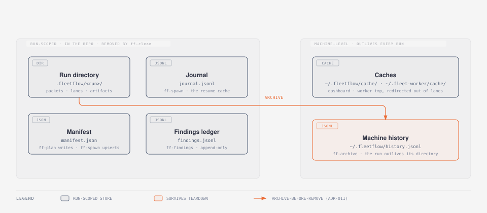

# Architecture — how the shipped system works

Living current-state document (drift is a bug — update in the same commit as
the behaviour). Decisions and their rejected alternatives live in
[docs/adr/](adr/); this file states what IS, and cites the WHY.

## The shape in one paragraph

One interactive **orchestrator session** (Fable/Opus) plans a run and keeps
all judgment; a set of bash **lifecycle scripts** owns the deterministic
mechanics; each **worker** is an OS process on its own provider, running in
its own git worktree lane; a **journal + manifest** make the run resumable;
and two HTML surfaces — a single-run monitor and a machine-wide dashboard
service — observe everything. Workers never talk to each other
([ADR-005](adr/ADR-005-hub-and-spoke-worker-topology.md)): results come
back through one collect gate, and the orchestrator decides what happens next.


## Components

| Component | Kind | Role |
|---|---|---|
| Orchestrator session | interactive Claude Code | plans packets, makes verdicts, commits Codex lanes ([ADR-006](adr/ADR-006-codex-lanes-never-self-commit.md)), lands via fleet-ops |
| `scripts/ff-plan.sh` | bash CLI | pre-spawn planning stage: drafts plan/packets/manifest, lints them (gate, [ADR-030](adr/ADR-030-plan-lint-gates-the-spawn-and-reports-armed-status.md)), refutes the plan cross-provider ([ADR-028](adr/ADR-028-the-plan-is-refuted-before-the-fleet-spawns.md)), estimates cost, expands generators ([ADR-029](adr/ADR-029-generator-backed-packets-registry-owns-expansions.md)) |
| `scripts/ff-doctor.sh` | bash CLI | preflight: binaries, provider auth, live model probes; refuses to bless an unservable fleet |
| `scripts/ff-spawn.sh` | bash CLI | uniform spawner: worktree lane + guard preamble + journal record + per-model launch (GLM via fleet-worker, `codex exec`, `grok -p`, `pi -p`, `claude -p`) |
| `scripts/ff-collect.sh` | bash CLI | per-model result gate (success semantics differ by harness), schema validation, escape guard (`--check-main-clean`, [ADR-009](adr/ADR-009-escape-guard-and-baseline.md)) |
| `scripts/ff-status.sh` | bash CLI | the ONE implementation of lane state: running/stalled ([ADR-008](adr/ADR-008-stall-detection-trusts-activity-not-state.md)) /abandoned ([ADR-025](adr/ADR-025-abandonment-demotes-silent-inflight-lanes.md)) /failed/done, tokens, activity |
| `scripts/ff-run.sh` | bash CLI | `wave` sequences post-build QA ([ADR-018](adr/ADR-018-post-build-waves-posture-selects-depth-gate-selects-attendance.md)); `resume` replays the manifest through the journal cache |
| `scripts/ff-findings.sh` | bash CLI | append-only findings ledger (fingerprint-deduped) driving triage/fix/waive |
| `scripts/ff-chip.sh` | bash CLI | adopts a human-clicked chip session as an ordinary lane ([ADR-021](adr/ADR-021-chips-are-lanes-not-a-second-worker-class.md)) |
| `scripts/ff-archive.sh` / `ff-clean.sh` / `ff-sweep.sh` | bash CLI | teardown: archive-before-remove ([ADR-011](adr/ADR-011-archive-before-remove.md)), lane reclaim, machine-wide housekeeping ([ADR-020](adr/ADR-020-sweep-reclaims-only-archived-and-landed.md)/[024](adr/ADR-024-sweep-caches-bytes-never-verdicts.md)) |
| `scripts/ff-serve.py` + `ff-aggregate.py` | python service | machine-wide dashboard: one process, request-driven rebuilds ([ADR-002](adr/ADR-002-ff-serve-is-one-process.md)), discovery across configured roots |
| `assets/ff-dashboard.html` | single-file page | every run on the box, live + archived; zero external references ([ADR-003](adr/ADR-003-dashboard-zero-external-references.md)); hand-maintained HARNESS/PRICING registers ([ADR-014](adr/ADR-014-fleet-view-three-registers.md)/[015](adr/ADR-015-pricing-basis-and-blended-plans.md)) |
| `assets/ff-monitor.html` | single-file page | one run, live pips + stall/abandon rendering |
| `assets/ff-runcard.js` | embedded module | the run-card renderer, byte-identical in dashboard and chat widget ([ADR-019](adr/ADR-019-one-run-card-renderer-two-embedded-copies.md)) |
| `assets/roles/*.role.md` | role cards | twelve persona contracts prepended into packets ([ADR-031](adr/ADR-031-role-cards-persona-register.md)) |
| `assets/plan.tmpl.md` / `packet.tmpl.md` | templates | the frozen plan-doc and packet shapes ff-plan instantiates |
| `assets/wave-packets/*.tmpl.md` | templates | finder-wave role prompts for the QA pipeline |
| `references/` | living docs | per-model worker contracts, native-Workflow extraction, model routing, generator registry |

Zoomed to a single lane, those components compose like this — the packet and
its role card entering the cage, the four artifacts the lane carries while it
works, and the two records the journal keeps:


## Data — where run state lives

| Store | Path | Owner | Notes |
|---|---|---|---|
| Run dir | `<repo>/.fleetflow/<run>/` | scripts | packets, per-lane artifacts, worktree lanes (`wt-<id>`) |
| Journal | `.fleetflow/<run>/journal.jsonl` | ff-spawn | `started`/`result` records keyed `sha256(model+prompt+opts)` — the resume cache ([ADR-012](adr/ADR-012-packet-cache-key-purity.md)) |
| Manifest | `.fleetflow/<run>/manifest.json` | ff-plan authors, ff-spawn upserts run-state | `phases[]` strings are FROZEN; plan metadata is the sibling `plan` key ([ADR-026](adr/ADR-026-ff-plan-authors-the-manifest-spawn-consumes-it.md)) |
| Findings ledger | `.fleetflow/<run>/findings.jsonl` | ff-findings | append-only, fingerprint-deduped; waivers in `docs/waivers.json` |
| Machine history | `~/.fleetflow/history.jsonl` | ff-archive | a run's record outlives its directory; the dashboard's history section |
| Caches | `~/.fleetflow/cache/`, `~/.fleet-worker/cache/<run>-<id>/` | dashboard / workers | aggregate cache; per-lane tmp redirected OUT of worktrees |

What the table cannot show is **lifetime**. Four of those stores live inside
the repo and die with the run directory; two live on the machine and outlive
every run. Exactly one step crosses that boundary, and it runs *before*
teardown — which is the whole reason a run's record survives the deletion of
its own directory ([ADR-011](adr/ADR-011-archive-before-remove.md)):



## The run pipeline

```
ff-plan (draft → lint → refute) → ff-doctor → ff-spawn ×N → ff-collect (gate)
        → [ff-run wave: finders → triage → fix → re-verify] → fleet-ops land → ff-clean
```

The first arm of that line is a gate in its own right — nothing spawns until
the plan survives lint and a cross-provider Adversary:


From `ff-doctor` onward the run is the lifecycle proper, verification built in
rather than bolted on:


Safety is structural, not advisory: worktree isolation per mutating worker,
the guard preamble's relative-paths rule plus the collect-time escape guard,
per-provider sandbox pins ([ADR-007](adr/ADR-007-codex-windows-sandbox-unelevated-pin.md)),
stall/abandon detection from activity rather than state, orphan reaping by
journalled ancestry, and archive-before-remove teardown. No stage deploys;
the pipeline terminates at land.

## Invariant map — what the test gate pins

`tests/run.sh` (450 hermetic assertions; exports its own `FLEETFLOW_HOME`)
mechanically enforces the invariants prose alone would lose: dashboard
zero-external-references, run-card byte parity, STATE_RANK consistency across
its five copies, pricing/HARNESS register entries, legacy `brain`→`model`
fallback order ([ADR-017](adr/ADR-017-model-rename-alias-fallback-order.md)),
ff-plan's lint contract, and ADR format (`adr-lint --strict`). The suite is
the repo's one `check` entry point; run it before landing anything.
